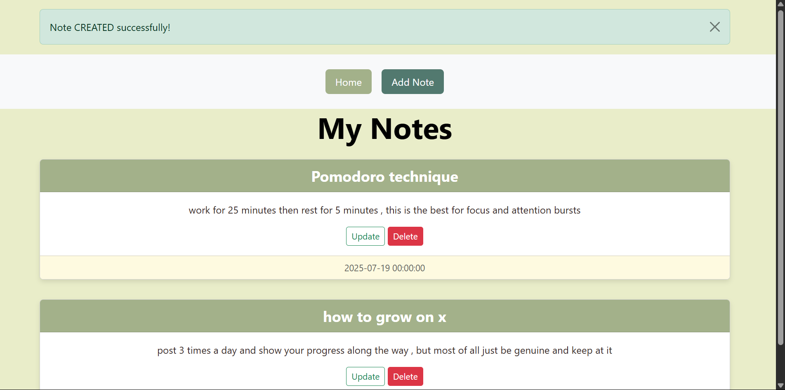
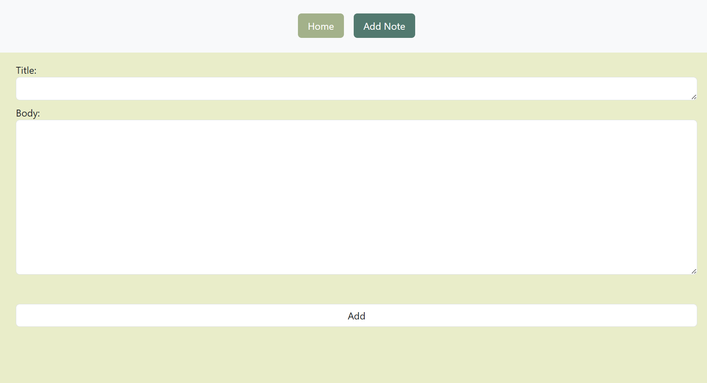

# 📝 Flask Notes App

A simple notes application built with Flask, SQLAlchemy, and Bootstrap.

 
## Features

- Add, update, and delete notes
- Stores notes with title, content, and date
- Clean Bootstrap interface
- Flash messages for user feedback

## Technologies

- Python
- Flask
- SQLAlchemy
- Bootstrap 5
- WTForms

## Setup

```bash
git clone https://github.com/your-username/flask-notes-app.git
cd flask-notes-app
python -m venv .venv
.venv\Scripts\activate  # Or source .venv/bin/activate on Mac/Linux
pip install -r requirements.txt
python app.py